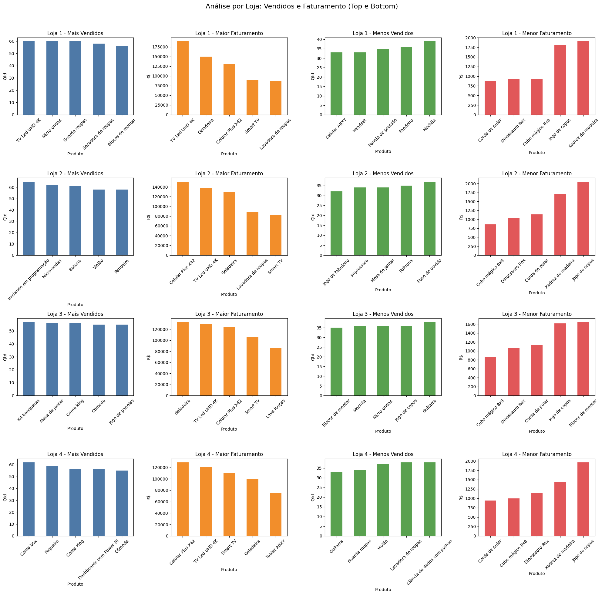
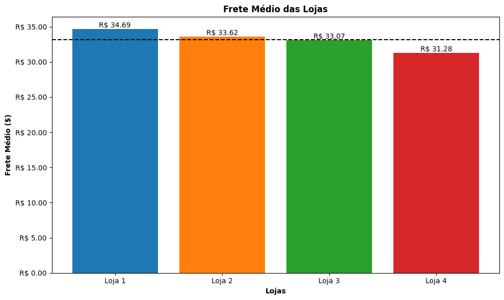

# Desafio Alura: Análise da loja Alura Store

## Desafio
Durante este desafio, eu irei ajudar o Senhor João a decidir qual loja da sua rede Alura Store vender para iniciar um novo empreendimento. Para isso, vou analisar dados de vendas, desempenho e avaliações das 4 lojas fictícias da Alura Store. O objetivo é identificar a loja com menor eficiência e apresentar uma recomendação final baseada nos dados.

#### O que vou praticar:
* Carregar e manipular dados CSV com a biblioteca Pandas .
* Criar visualizações de dados com biblioteca Matplotlib.
* Analisar métricas como faturamento, avaliações e desempenho de vendas.

#### Ferramentas utilizadas:
* Google Colab 
* Python
* Pandas
* Matplotlib

#### Análises realizadas

1. [Análise do faturamento](#1-análise-do-faturamento)
2. [Vendas por Categoria](#2-vendas-por-categoria)
3. [Média de Avaliação das Lojas](#3-média-de-avaliação-das-lojas)
4. [Produtos Mais e Menos Vendidos](#4-produtos-mais-e-menos-vendidos)
5. [Frete Médio por Loja](#5-frete-médio-por-loja)
---
## Visualização e Isights
### 1. Análise do faturamento
A **Loja 1** obteve o maior faturamento, superando as demais com uma diferença de R$ 146.051,54 em relação à **Loja 4**, que teve o menor faturamento.

A variação entre as lojas é relativamente pequena, indicando uma distribuição equilibrada do desempenho comercial.

---
### 2. Vendas por Categoria
A Loja 1 apresenta o melhor desempenho geral, especialmente em categorias de maior valor agregado (eletrônicos e eletrodomésticos).

Loja 4 é a que mais sofre variação negativa em várias categorias, o que pode explicar o baixo faturamento.

---
### 3. Média de Avaliação das Lojas

* Loja 3 apresentou a melhor média de avaliação, com 4,05 estrelas, indicando um alto nível de satisfação dos clientes.
* Loja 2 também teve um desempenho forte, com 4,04 estrelas, ficando logo atrás da líder.
* Loja 4 ficou em terceiro, com 4,00 estrelas, mantendo uma média sólida, porém um pouco inferior às duas primeiras.
* Loja 1, com 3,98 estrelas, foi a que obteve a menor média, embora ainda dentro de um bom patamar de satisfação (Maior quer 3,5).

---
### 4. Produtos Mais e Menos Vendidos

Os dados revelam padrões interessantes, como a TV Led UHD 4K sendo destaque em vendas e faturamento na Loja 1, e o Celular Plus X42 liderando o faturamento em várias lojas. Por outro lado, itens como calculadoras, canecas e jarra térmica aparecem frequentemente entre os menos vendidos e menos rentáveis, indicando baixa rotatividade e possível oportunidade de descontinuação ou promoção estratégica.

---
### 5. Frete Médio por Loja
* A Loja 1 apresenta o maior frete médio, com 34,69 reais, superando as demais em até 3,41 em relação à Loja 4.
* A Loja 4, por sua vez, tem o frete mais acessível, o que pode representar uma vantagem competitiva na decisão de compra de clientes sensíveis a custos logísticos.
* As Loja 2 e Loja 3 têm fretes médios muito próximos, sugerindo uma política de preços semelhante.

## Conclusão

De acordo com os dados das lojas, a Loja 4 deveria ser vendida devido aos seguintes fatores:

* Menor faturamento dentre as três lojas.
* A segunda menor média de avaliação, ou seja, mesmo com baixo faturamento possui baixa taxa de aceitação.
* É a loja que menos vende dentro da maioria das categorias de produtos.